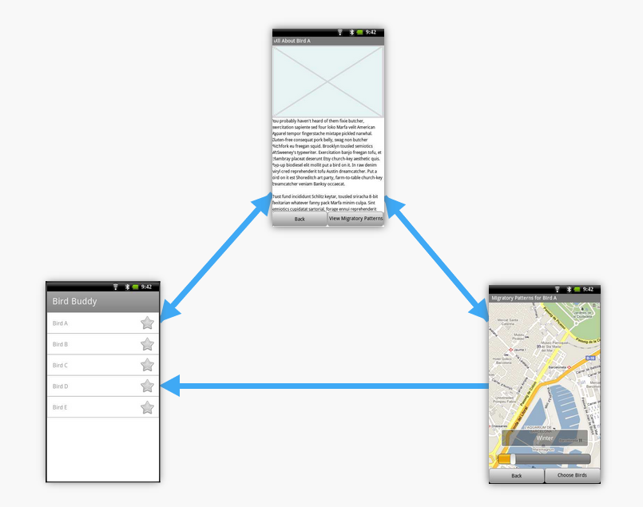
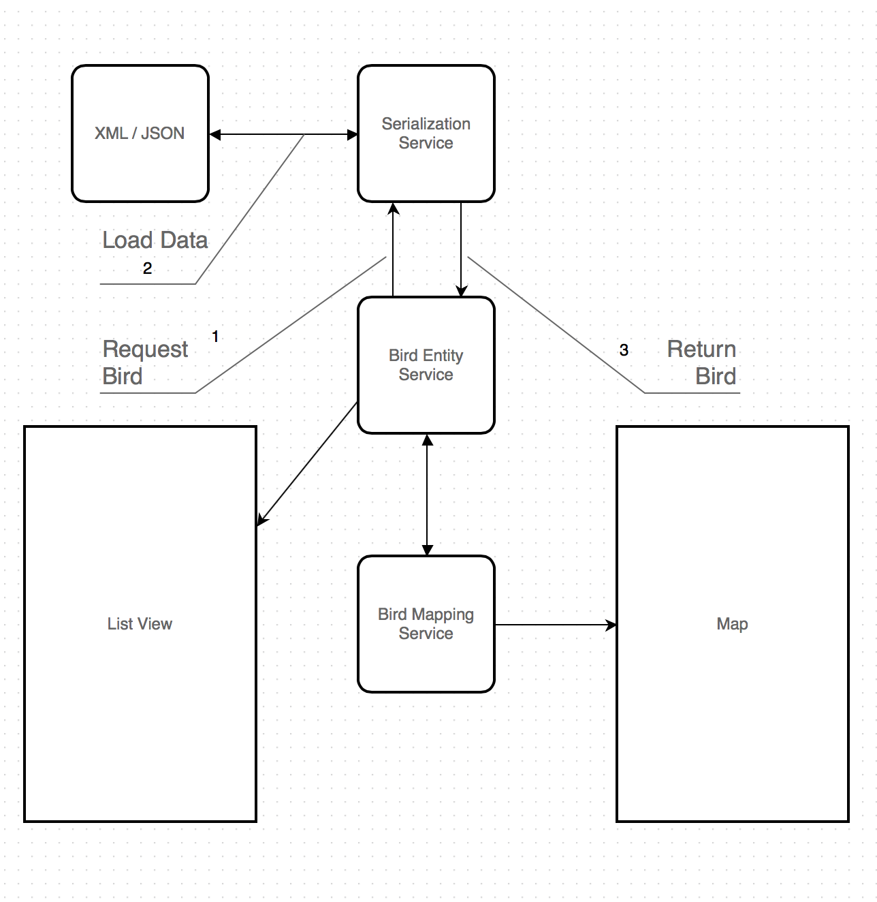

Design Document
===============

## Purpose of Project

We are developing an application to assist bird watchers and other people interested in birds. "Bird Buddy" displays the migratory patterns of several different birds as well as information about these birds. This application will also expose the developers to Android app development as well as test driven development.

## UI Flowchart

Below is a diagram showing the different components of the application. To view a working demo of the application, visit the [fluidUI demo](https://www.fluidui.com/editor/live/preview/p_FyTNToGobErf9M3q2ElTvOFabkCXOkQt.1383625832629).

## High Level Entities

### Serialization Service
This service handles loading/saving entities from XML or JSON files. 

### Bird Entity Service
The Bird Service entity handles the birds being used by the application.

### Bird Map Service
The Bird Map Service entity works on plotting the bird's migration paths onto a given Map.

## Low Level Design

## Benefits, Assumptions, and Risks

### Benefits

Nobody on our team has ever developed for Android before, so this will be a great learning project for us. We have aimed to keep the scope of the project manageable so that we can learn the basics of Android development without getting too concerned with creating a lot of content.

We assume that the user will have an Android 4.x phone or the ability to emulate it.

There are no significant risks to the user of this application. At worst, the user's phone may crash. Data services should not be used.
